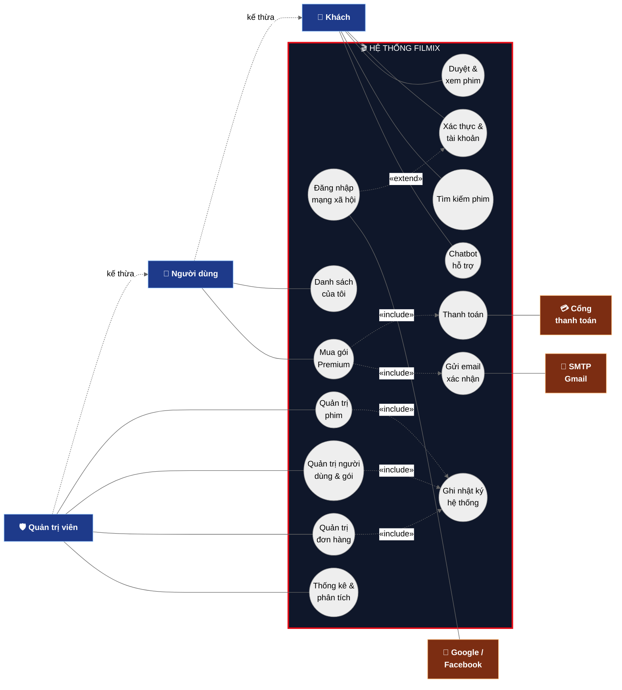

# Sơ Đồ Use Case Tổng Quát — FILMIX

Bản rút gọn (vừa khổ A4), đúng chuẩn UML:

- **Actor ↔ use case**: chỉ nối **association** (đường liền, không có quan hệ include/extend).
- **`«include»` / `«extend»`**: chỉ nối **use case với use case**.
- Google/Facebook, Cổng thanh toán, SMTP là **actor phụ** (hệ thống ngoài) đặt bên phải, nối association tới đúng use case dùng chúng.

## Quan hệ trong sơ đồ

| Loại quan hệ | Cặp | Ý nghĩa |
|---|---|---|
| `«extend»` | Đăng nhập MXH → Xác thực & tài khoản | Đăng nhập Google/Facebook là luồng mở rộng tùy chọn của xác thực |
| `«include»` | Mua gói Premium → Thanh toán | Mọi đơn mua đều bắt buộc qua bước thanh toán |
| `«include»` | Mua gói Premium → Gửi email xác nhận | Sau thanh toán luôn gửi email xác nhận |
| `«include»` | Quản trị phim / người dùng / đơn hàng → Ghi nhật ký | Thao tác quản trị luôn ghi audit log |
| association | Đăng nhập MXH — Google/Facebook | Actor phụ cung cấp OAuth |
| association | Thanh toán — Cổng thanh toán | Actor phụ xử lý giao dịch (mock) |
| association | Gửi email xác nhận — SMTP Gmail | Actor phụ gửi thư đi |

## Diễn giải gói chức năng

| Use case | Gồm các chức năng | Controller chính |
|---|---|---|
| **Xác thực & tài khoản** | Đăng ký, đăng nhập, đăng xuất, hồ sơ | `AccountController` |
| **Đăng nhập mạng xã hội** | OAuth Google/Facebook | `AccountController.ExternalLogin` |
| **Duyệt & xem phim** | Trang chủ, phim lẻ, TV series, mới & nổi bật, chi tiết, xem phim/teaser, đề xuất, ghi tiến độ xem | `Home/Movies/TVShows/NewHot/ProductController`, `ViewingHistoryController` |
| **Tìm kiếm phim** | Tìm kiếm + gợi ý tự động | `SearchController` |
| **Danh sách của tôi** | Xem / thêm / xóa watchlist, đồng bộ CSDL | `WatchlistController` |
| **Mua gói Premium** | Xem gói, giỏ hàng, checkout, kích hoạt Premium, lịch sử đơn | `Subscription/Cart/OrderController` |
| **Thanh toán** | Xử lý thanh toán mock | `OrderController.ProcessMockPayment` |
| **Gửi email xác nhận** | Gửi mail hóa đơn qua SMTP | `EmailService` |
| **Chatbot hỗ trợ** | Hỏi đáp theo intent | `ChatbotApiController` |
| **Quản trị phim** | CRUD phim + upload poster | Admin `ProductController` |
| **Quản trị người dùng & gói** | Cấp/thu quyền Admin, Premium, quản lý gói | Admin `UserController`, `SubscriptionController` |
| **Quản trị đơn hàng** | Danh sách, đổi trạng thái, đồng bộ vòng đời | Admin `OrderController` |
| **Thống kê & phân tích** | Dashboard, phân tích top phim/thể loại | Admin `Dashboard/AnalyticsController` |
| **Ghi nhật ký hệ thống** | Audit log mọi thao tác quan trọng | `LogService`, Admin `SystemLogController` |

> Admin và Người dùng kế thừa toàn bộ quyền của Khách (generalization). Xuất ra A4 nên để **khổ ngang (landscape)** cho cân đối.
